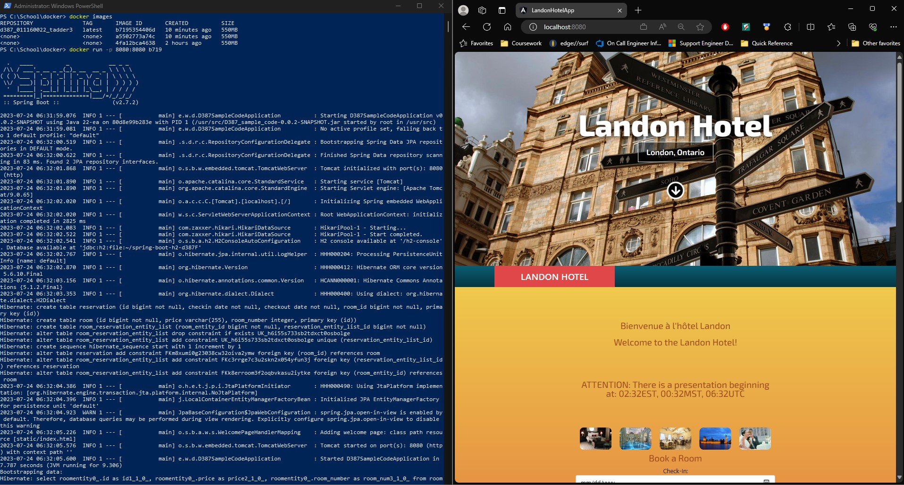

C.   Modify the Landon Hotel scheduling application for localization and internationalization by doing the following:  
1.   Install the Landon Hotel scheduling application in your integrated development environment (IDE). Modify the Java classes of application to display a welcome message by doing the following:   
a.   Build resource bundles for both English and French (languages required by Canadian law). Include a welcome message in the language resource bundles.  

<pre>
        CREATE: 
        Resource Bundle 'translation'

            translation_en_us.properties
                hello=Hello!
                welcome=Welcome to the Landon Hotel!

            translation_fr_ca.properties
                hello=Bonjour!
                welcome=Bienvenue à l'hôtel Landon
</pre>

b.   Display the welcome message in both English and French by applying the resource bundles using a different thread for each language.  

<pre>
        CREATE:

        internationalization.WelcomeController.java

            package edu.wgu.d387_sample_code.internationalization;

            import org.springframework.http.HttpStatus;
            import org.springframework.http.ResponseEntity;
            import org.springframework.web.bind.annotation.CrossOrigin;
            import org.springframework.web.bind.annotation.GetMapping;
            import org.springframework.web.bind.annotation.RequestParam;
            import org.springframework.web.bind.annotation.RestController;
            
            import java.util.Locale;
            
            @CrossOrigin(origins = "http://localhost:4200") // Needed for front end
            @RestController
            public class WelcomeController {
            
                @GetMapping("/welcome")
            
                public ResponseEntity<String> displayWelcome (@RequestParam("lang") String lang) { // Request the html lang parameter here
                    Locale locale = Locale.forLanguageTag(lang); // create locale object based on lang parameter
                    WelcomeMessage welcomeMessage = new WelcomeMessage(locale); // create welcomeMessage to pull the corresponding lang
                    return new ResponseEntity<String> (welcomeMessage.getWelcomeMessage(), HttpStatus.OK); // respond
                }
            }

        CREATE: 

        internationalization.WelcomeMessage.java 

            package edu.wgu.d387_sample_code.internationalization;
            
            import java.util.Locale;
            import java.util.ResourceBundle;
            
            public class WelcomeMessage implements Runnable {
            
                Locale locale;
            
                // Constructor
                public WelcomeMessage(Locale locale) {
                    this.locale = locale;
                }
            
                public String getWelcomeMessage() {
                    ResourceBundle bundle = ResourceBundle.getBundle("translation",locale);
                    return bundle.getString("welcome");
                }
            
                @Override
                public void run() {
                    System.out.println( "Thread verification: " + getWelcomeMessage() + ", ThreadID: " + Thread.currentThread().getId() );
                }
            }

        MODIFY:

        D387SampleCodeApplication.java, LINES 20-27

            // Create threads for the Welcome Message in French and English
            WelcomeMessage welcomeMessageEnglish = new WelcomeMessage(Locale.US);
            Thread englishWelcomeThread = new Thread(welcomeMessageEnglish);
            englishWelcomeThread.start();
            
            WelcomeMessage welcomeMessageFrench = new WelcomeMessage(Locale.CANADA_FRENCH);
            Thread frenchWelcomeThread = new Thread(welcomeMessageFrench);
            frenchWelcomeThread.start();
</pre>

2.   Modify the front end to display the price for a reservation in currency rates for U.S. dollars ($), Canadian dollars (C$), and euros (€) on different lines.  
Note: It is not necessary to convert the values of the prices.  

    

<pre>
        MODIFY: 

        app.component.ts, lines 70-71

            // C2 - Code to add the CAD/EUR "prices"
            this.rooms.forEach( room => { room.priceCAD = room.price; room.priceEUR = room.price})
    
        app.component.ts, lines 120-122

            // C2 - Code to add the CAD/EUR "prices"
            priceCAD:string;
            priceEUR:string;

        app.component.html, lines 87-90

            &lt !-- C2 &gt - Code to add CAD and EUR price listings -- &gt 
            &lt strong &gt Price: CA${{room.priceCAD}} &lt /strong &gt &lt br &gt 
            &lt strong &gt Price: EUR€{{room.priceEUR}} &lt /strong &gt &lt br &gt 
            &lt !-- C2 - Code to add CAD and EUR price listings -- &gt 

</pre>

3.   Display the time for an online live presentation held at the Landon Hotel by doing the following:
a.   Write a Java method to convert times between eastern time (ET), mountain time (MT), and coordinated universal time (UTC) zones. 

<pre>
        CREATE:

        TZConvert.java

            package edu.wgu.d387_sample_code.internationalization;
            
            import org.springframework.web.bind.annotation.CrossOrigin;
            import java.time.*;
            import java.time.format.DateTimeFormatter;
            
            @CrossOrigin(origins = "http://localhost:4200")
            public class TZConvert {
            
                public static String getTime() {
                    ZonedDateTime time = ZonedDateTime.now();
                    DateTimeFormatter timeFormat = DateTimeFormatter.ofPattern("HH:mm");
            
                    ZonedDateTime est = time.withZoneSameInstant(ZoneId.of("America/New_York"));
                    ZonedDateTime mst = time.withZoneSameInstant(ZoneId.of("America/Denver"));
                    ZonedDateTime utc = time.withZoneSameInstant(ZoneId.of("UTC"));
            
                    String times = est.format(timeFormat) + "EST, " + mst.format(timeFormat) + "MST, " + utc.format(timeFormat) + "UTC";
            
                    return times;
                }
            }

</pre>

b.   Use the time zone conversion method from part C3a to display a message stating the time in all three times zones in hours and minutes for an online, live presentation held at the Landon Hotel. The times should be displayed as ET, MT, and UTC.
Note: Remember to update your README file after every requirement.

    
    
<pre>
        CREATE:
        
        TZConvertController.java

            package edu.wgu.d387_sample_code.internationalization;
            
            import org.springframework.http.HttpStatus;
            import org.springframework.http.ResponseEntity;
            import org.springframework.web.bind.annotation.CrossOrigin;
            import org.springframework.web.bind.annotation.GetMapping;
            import org.springframework.web.bind.annotation.RequestMapping;
            import org.springframework.web.bind.annotation.RestController;
            
            @RestController
            @CrossOrigin(origins = "http://localhost:4200")
            public class TZConvertController {
            
                @GetMapping("/presentation")
                public ResponseEntity<String> announcePresentation() {
                    String announcement = "ATTENTION: There is a presentation beginning at: " + TZConvert.getTime();
                    return new ResponseEntity<String> (announcement, HttpStatus.OK);
                }
            }

        INSERT

        app.compontent.ts, LINES 22-23

            // C3B - Code to announce the presentation w/ time zone conversions
            announcePresentation$!: Observable &lt string &gt

        app.component.ts, LINES 44-45

            // C3B - Code to add conference announcement
            this.announcePresentation$ = this.httpClient.get(this.baseURL + '/presentation', {responseType: 'text'} )

        INSERT

        app.component.html, LINES 31-35

             &lt !-- C3B - Code to add presentation announcement -- &gt 
             &lt div class="scene" id="presentation" &gt   
             &lt h1 &gt {{announcePresentation$ | async}} &lt /h1 &gt 
             &lt /div &gt  &lt br &gt  &lt br &gt 
             &lt !-- C3B - Code to add presentation announcement -- &gt 

</pre>    

D.   Explain how you would deploy the Spring application with a Java back end and an Angular front end to cloud services and create a Dockerfile using the attached supporting document “How to Create a Docker Account” by doing the following:
1.   Build the Dockerfile to create a single image that includes all code, including modifications made in parts C1 to C3. Commit and push the final Dockerfile to GitLab.

<pre>
        CREATE:

        Dockerfile

            FROM openJDK:11
            COPY ./D387_sample_code-0.0.2-SNAPSHOT.jar /usr/src/D387_sample_code-0.0.2-SNAPSHOT.jar
            WORKDIR /usr/src
            EXPOSE 8080
            CMD ["java", "-jar", "D387_sample_code-0.0.2-SNAPSHOT.jar"]

</pre>

2.   Test the Dockerfile by doing the following:
Create a Docker image of the current multithreaded Spring application.
Run the Docker image in a container and give the container a name that includes D387_[student ID].
Submit a screenshot capture of the running application with evidence it is running in the container.

3.   Describe how you would deploy the current multithreaded Spring application to the cloud. Include the name of the cloud service provider you would use.
Note: Remember to commit and push your changes to GitLab.

<pre>
I am most familiar with the Azure cloud environment, so I would start there. Azure has the ability to deploy custom Docker 
Containers without having to provision a server. First, I would have to create the actual Docker Container. At a high level, 
I would need to package the project using Maven, then copy that .jar file into a base image that has the Java runtime environment. 
Then I would have to make the app accessible over the required port 8080. Once I've confirmed that the container is working as 
expected, I would then push the container to an existing (or create a new) Azure Container Registry. I would then be able 
to deploy the container application to an Azure Container instance. 
</pre>
     